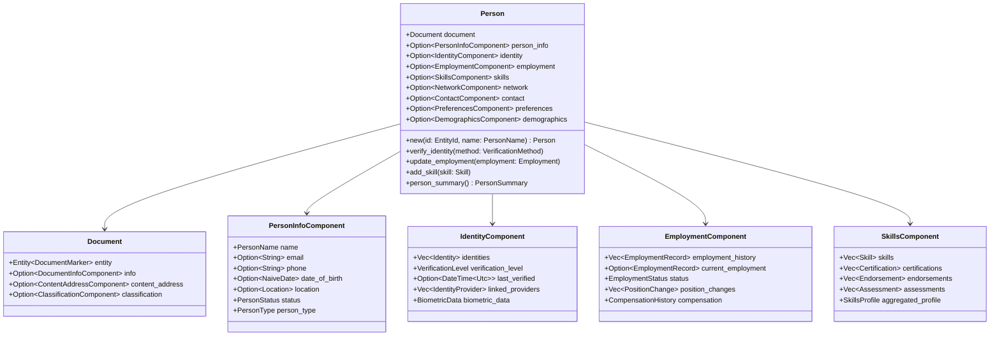
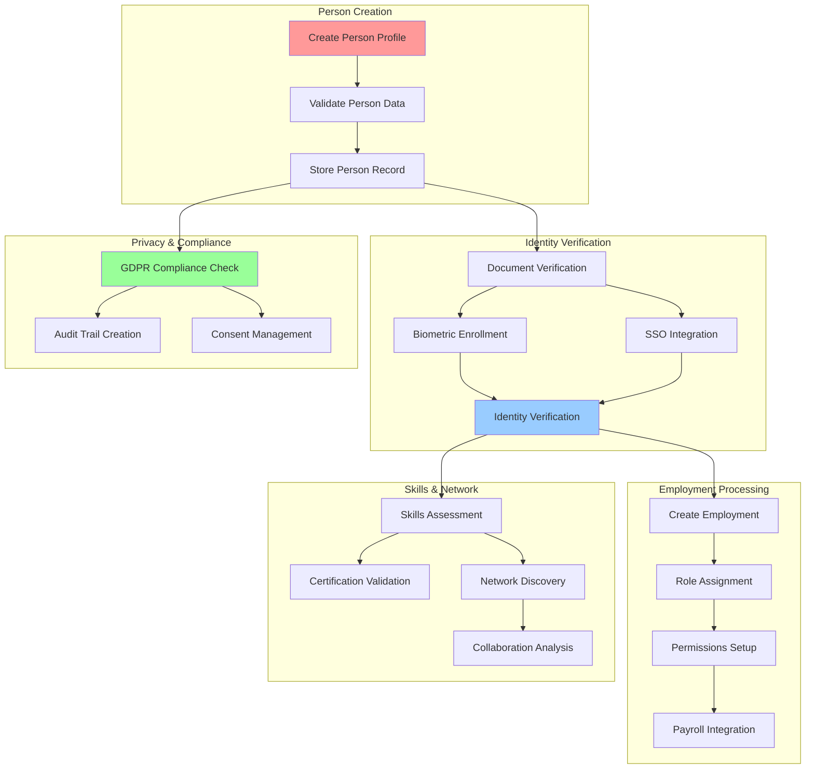

<!--
Copyright 2025 Cowboy AI, LLC.
SPDX-License-Identifier: MIT
-->

# CIM Domain: Person Extension

[](https://opensource.org/licenses/MIT)
[](https://www.rust-lang.org)

> Person domain extension for CIM Document system, providing specialized functionality for person profile management, identity verification, employment tracking, skills certification, and professional network analysis.

## Overview

The Person domain extends the base `cim-domain-document` with specialized functionality for managing people within organizations. It follows the composition-over-inheritance pattern where `Person` composes a base `Document` and adds person-specific components and processing capabilities.

### Key Features

- 👤 **Person Profile Management**: Comprehensive person lifecycle management with privacy controls
- 🔐 **Multi-Factor Identity Verification**: Document validation, biometric verification, and SSO integration
- 💼 **Employment Lifecycle**: Complete employment record management from onboarding to offboarding
- 🎯 **Skills & Certification Tracking**: Professional skills assessment, certification management, and endorsements
- 🌐 **Professional Network Analysis**: Relationship mapping, influence analysis, and collaboration insights
- 📋 **Privacy & Compliance**: GDPR-compliant data handling with automated privacy workflows
- 🔄 **Workflow Orchestration**: Pre-defined workflows for common HR and people operations
- 📊 **Demographics & Analytics**: Anonymized demographic analysis and organizational insights

## Mathematical Foundation

The CIM Person Domain is built on a formal [Person Subject Algebra](docs/algebra/README.md) that provides:

- **Rigorous Mathematical Foundation**: 7-tuple algebraic structure with proven properties
- **Type Safety**: Compile-time guarantees for person management operations  
- **Compositional Operations**: Sequential (⊕), Parallel (⊗), and Conditional (→) transformations
- **Privacy Guarantees**: Algebraic privacy constraints ensuring GDPR compliance
- **Distributed Processing**: NATS-based implementation of algebraic operations

### Key Algebraic Operations

```
Sequential:   create_person ⊕ verify_identity ⊕ create_employment  
Parallel:     skills_assessment ⊗ network_discovery ⊗ preferences_setup
Conditional:  employment_created →[same_location] discover_local_colleagues
```

See [Person Subject Algebra Documentation](docs/algebra/README.md) for complete mathematical definitions.

## Architecture

### Person Profile Composition



### Person Management Pipeline



## Usage Examples

### Basic Person Profile Creation

```rust
use cim_domain_person::prelude::*;
use chrono::NaiveDate;
use uuid::Uuid;

#[tokio::main]
async fn main() -> Result<(), Box<dyn std::error::Error>> {
    let mut handler = PersonCommandHandler::new();
    
    // Create a person profile
    let person_id = EntityId::new();
    let organization_id = Uuid::new_v4();
    
    let create_command = CreatePerson::new(
        person_id,
        PersonName::new("John", Some("A."), "Doe")?,
    )
    .with_email("john.doe@example.com".to_string())
    .with_phone("+1-555-123-4567".to_string())
    .with_date_of_birth(NaiveDate::from_ymd_opt(1985, 6, 15).unwrap())
    .with_organization_id(organization_id)
    .with_person_type(PersonType::Employee);
    
    let events = handler.handle_create_person(create_command).await?;
    println!("Created person with {} events", events.len());
    
    Ok(())
}
```

### Identity Verification Pipeline

```rust
use cim_domain_person::prelude::*;

#[tokio::main]
async fn main() -> Result<(), Box<dyn std::error::Error>> {
    // Initialize identity services
    let identity_service = DefaultIdentityService::new()
        .with_document_verification(true)
        .with_biometric_enrollment(true);
    
    let person_id = EntityId::new();
    
    // Create identity with document verification
    let identity = Identity::new(
        IdentityType::GovernmentId,
        "DL123456789".to_string(),
        "DMV".to_string(),
    );
    
    let verification_data = DocumentVerificationData {
        document_type: DocumentType::DriversLicense,
        document_number: "DL123456789".to_string(),
        expiry_date: NaiveDate::from_ymd_opt(2028, 6, 15).unwrap(),
        issuing_authority: "DMV".to_string(),
        document_image_cid: Some(cid::Cid::default()),
    };
    
    // Verify identity
    let verification_result = identity_service
        .verify_identity(person_id, identity, verification_data)
        .await?;
        
    println!("Verification status: {:?}", verification_result.status);
    println!("Confidence score: {:.2}%", verification_result.confidence * 100.0);
    
    if verification_result.requires_manual_review {
        println!("Manual review required due to: {:?}", verification_result.review_reasons);
    }
    
    Ok(())
}
```

### Employment Lifecycle Management

```rust
use cim_domain_person::prelude::*;

#[tokio::main]
async fn main() -> Result<(), Box<dyn std::error::Error>> {
    let employment_service = DefaultEmploymentService::new();
    let person_id = EntityId::new();
    let organization_id = Uuid::new_v4();
    
    // Create employment record
    let employment = EmploymentRecord::new(
        organization_id,
        "Senior Software Engineer".to_string(),
        "Engineering".to_string(),
    )
    .with_manager_id(Uuid::new_v4())
    .with_start_date(NaiveDate::from_ymd_opt(2025, 1, 15).unwrap())
    .with_employment_type(EmploymentType::FullTime)
    .with_salary(Compensation::annual_salary(120000, "USD".to_string()));
    
    let employment_result = employment_service
        .create_employment(person_id, employment)
        .await?;
        
    println!("Employment created: {}", employment_result.employment_id);
    
    // Update employment status after probation
    let status_update = EmploymentStatusUpdate {
        status: EmploymentStatus::Active,
        effective_date: NaiveDate::from_ymd_opt(2025, 4, 15).unwrap(),
        reason: "Probation period completed successfully".to_string(),
        updated_by: "hr-system".to_string(),
    };
    
    employment_service
        .update_employment_status(employment_result.employment_id, status_update)
        .await?;
        
    println!("Employment status updated to Active");
    
    Ok(())
}
```

### Skills and Certification Management

```rust
use cim_domain_person::prelude::*;

#[tokio::main]
async fn main() -> Result<(), Box<dyn std::error::Error>> {
    let skills_service = DefaultSkillsService::new();
    let person_id = EntityId::new();
    
    // Add programming skills
    let rust_skill = Skill::new(
        "Rust Programming".to_string(),
        SkillCategory::ProgrammingLanguage,
        ProficiencyLevel::Expert,
    )
    .with_years_experience(5)
    .with_verified(true);
    
    let python_skill = Skill::new(
        "Python".to_string(),
        SkillCategory::ProgrammingLanguage,
        ProficiencyLevel::Advanced,
    )
    .with_years_experience(8)
    .with_verified(true);
    
    skills_service.add_skill(person_id, rust_skill).await?;
    skills_service.add_skill(person_id, python_skill).await?;
    
    // Add certification
    let certification = Certification::new(
        "AWS Certified Solutions Architect".to_string(),
        "Amazon Web Services".to_string(),
        NaiveDate::from_ymd_opt(2024, 6, 15).unwrap(),
    )
    .with_expiry_date(NaiveDate::from_ymd_opt(2027, 6, 15).unwrap())
    .with_certificate_id("AWS-CSA-123456".to_string())
    .with_verification_url("https://aws.amazon.com/verification/123456".to_string());
    
    skills_service.add_certification(person_id, certification).await?;
    
    // Generate skills profile
    let profile = skills_service.generate_skills_profile(person_id).await?;
    println!("Skills profile generated:");
    println!("- Total skills: {}", profile.total_skills);
    println!("- Certifications: {}", profile.certifications.len());
    println!("- Top categories: {:?}", profile.top_skill_categories(3));
    
    Ok(())
}
```

### Professional Network Analysis

```rust
use cim_domain_person::prelude::*;

#[tokio::main]
async fn main() -> Result<(), Box<dyn std::error::Error>> {
    let network_service = DefaultNetworkService::new();
    let person_id = EntityId::new();
    let colleague_id = EntityId::new();
    
    // Establish professional connection
    let connection = Connection::new(
        colleague_id,
        RelationshipType::Colleague,
        ConnectionStrength::Strong,
    )
    .with_context("Same engineering team".to_string())
    .with_collaboration_frequency(CollaborationFrequency::Daily);
    
    network_service
        .establish_connection(person_id, connection)
        .await?;
        
    // Analyze network influence
    let influence_analysis = network_service
        .analyze_network_influence(person_id)
        .await?;
        
    println!("Network Analysis:");
    println!("- Direct connections: {}", influence_analysis.direct_connections);
    println!("- Network reach (2-degree): {}", influence_analysis.two_degree_reach);
    println!("- Influence score: {:.2}", influence_analysis.influence_score);
    println!("- Centrality measures: {:?}", influence_analysis.centrality_measures);
    
    // Discover collaboration opportunities
    let recommendations = network_service
        .discover_collaboration_opportunities(person_id)
        .await?;
        
    println!("Collaboration Recommendations:");
    for rec in recommendations.iter().take(5) {
        println!("- {} (confidence: {:.1}%)", rec.person_name, rec.confidence * 100.0);
    }
    
    Ok(())
}
```

## Person Components

### PersonInfoComponent

Core identifying information and status:

```rust
pub struct PersonInfoComponent {
    pub name: PersonName,
    pub email: Option<String>,
    pub phone: Option<String>,
    pub date_of_birth: Option<NaiveDate>,
    pub location: Option<Location>,
    pub status: PersonStatus,
    pub person_type: PersonType,
    
    // Privacy settings
    pub privacy_level: PrivacyLevel,
    pub consent_status: ConsentStatus,
    pub data_retention_policy: DataRetentionPolicy,
}
```

### IdentityComponent

Multi-factor identity verification and management:

```rust
pub struct IdentityComponent {
    pub identities: Vec<Identity>,
    pub verification_level: VerificationLevel,
    pub last_verified: Option<DateTime<Utc>>,
    pub linked_providers: Vec<IdentityProvider>,
    pub biometric_data: Option<BiometricData>,
    pub verification_history: Vec<VerificationAttempt>,
}

impl IdentityComponent {
    pub fn is_verified(&self) -> bool;
    pub fn verification_expiry(&self) -> Option<DateTime<Utc>>;
    pub fn identity_score(&self) -> f64;
    pub fn requires_reverification(&self) -> bool;
}
```

### EmploymentComponent

Complete employment lifecycle tracking:

```rust
pub struct EmploymentComponent {
    pub employment_history: Vec<EmploymentRecord>,
    pub current_employment: Option<EmploymentRecord>,
    pub status: EmploymentStatus,
    pub position_changes: Vec<PositionChange>,
    pub compensation_history: Vec<CompensationRecord>,
    pub performance_reviews: Vec<PerformanceReview>,
}

impl EmploymentComponent {
    pub fn tenure_years(&self) -> f64;
    pub fn promotion_history(&self) -> Vec<&PositionChange>;
    pub fn current_compensation(&self) -> Option<&CompensationRecord>;
    pub fn employment_timeline(&self) -> Timeline;
}
```

### SkillsComponent

Skills assessment and certification tracking:

```rust
pub struct SkillsComponent {
    pub skills: Vec<Skill>,
    pub certifications: Vec<Certification>,
    pub endorsements: Vec<Endorsement>,
    pub assessments: Vec<Assessment>,
    pub skills_profile: SkillsProfile,
    pub learning_plan: Option<LearningPlan>,
}

impl SkillsComponent {
    pub fn skill_categories(&self) -> Vec<SkillCategory>;
    pub fn proficiency_distribution(&self) -> ProficiencyDistribution;
    pub fn certification_status(&self) -> CertificationStatus;
    pub fn skills_gap_analysis(&self, target_role: &Role) -> SkillsGap;
}
```

## Privacy & GDPR Compliance

The Person domain includes comprehensive privacy features:

### Data Protection Features
- **Consent Management**: Granular consent tracking for different data uses
- **Data Minimization**: Only collect necessary data with purpose limitation
- **Right to Access**: Complete data export in machine-readable formats
- **Right to Rectification**: Data correction with audit trails
- **Right to Erasure**: Secure data deletion with retention compliance
- **Data Portability**: Structured data export for system migrations

### Privacy Configuration

```rust
let privacy_settings = PrivacySettings {
    enable_gdpr_compliance: true,
    default_retention_period: Duration::days(2555), // 7 years
    consent_expiry_period: Duration::days(365),
    anonymization_delay: Duration::days(30),
    audit_retention_period: Duration::days(3650), // 10 years
    require_explicit_consent: true,
};
```

## Workflow System

Pre-defined workflows for common operations:

### Onboarding Workflow
```rust
let onboarding_workflow = OnboardingWorkflow::new()
    .add_step(CreatePersonStep::new())
    .add_step(IdentityVerificationStep::new())
    .add_step(EmploymentSetupStep::new())
    .add_step(SystemAccessStep::new())
    .add_step(IntroductionStep::new());

let result = onboarding_workflow.execute(onboarding_data).await?;
```

### Available Workflows
- **Employee Onboarding**: Complete new hire processing
- **Employment Lifecycle**: Status changes, transfers, terminations
- **Skills Certification**: Assessment, certification, renewal
- **Privacy Compliance**: GDPR requests, data export, deletion
- **Identity Verification**: Multi-step identity validation
- **Network Analysis**: Relationship discovery and influence mapping

## Configuration

### Feature Flags

Optional dependencies can be enabled through Cargo features:

```toml
[dependencies]
cim-domain-person = { version = "0.5.0", features = ["biometrics", "ml-analysis", "gdpr"] }
```

Available features:
- `biometrics`: Enable biometric identity verification
- `ml-analysis`: Enable machine learning for network and skills analysis  
- `gdpr`: Enable GDPR compliance features
- `audit`: Enable comprehensive audit logging
- `full`: Enable all features

### Privacy & Security Settings

Configure privacy and security parameters:

```rust
let settings = PersonDomainSettings {
    identity_verification_timeout: Duration::from_secs(300),
    max_failed_verification_attempts: 3,
    session_timeout: Duration::from_secs(3600),
    enable_biometric_verification: true,
    require_mfa_for_sensitive_operations: true,
    gdpr_compliance_mode: GDPRComplianceMode::Strict,
    audit_level: AuditLevel::Comprehensive,
};
```

## Examples

See the [examples](examples/) directory for complete working examples:

- [`person_lifecycle.rs`](examples/person_lifecycle.rs) - Complete person management workflow
- [`identity_verification.rs`](examples/identity_verification.rs) - Multi-factor identity verification
- [`employment_management.rs`](examples/employment_management.rs) - Employment lifecycle tracking
- [`skills_certification.rs`](examples/skills_certification.rs) - Skills and certification management
- [`network_analysis.rs`](examples/network_analysis.rs) - Professional network analysis
- [`privacy_compliance.rs`](examples/privacy_compliance.rs) - GDPR compliance workflows

## Development

### Prerequisites

```bash
# Enter development shell
nix develop

# Install optional dependencies for full functionality
sudo apt-get install libssl-dev    # For identity verification
sudo apt-get install libsqlite3-dev # For local data storage
```

### Testing

```bash
# Run all tests
cargo test

# Run with specific features
cargo test --features "biometrics,ml-analysis,gdpr"

# Run integration tests
cargo test --test "*_integration_test"

# Run privacy compliance tests
cargo test --test "gdpr_compliance_test" --features gdpr
```

### Building

```bash
# Development build
cargo build

# Release build with optimizations
cargo build --release --features full
```

## Documentation

### Core Documentation
- [Person Subject Algebra](docs/algebra/README.md) - Mathematical foundations
- [NATS API Reference](docs/api/README.md) - Complete API documentation
- [Cross-Reference Index](docs/cross-reference.md) - Links between concepts and implementation

### Integration Guides
- [Configuration Guide](docs/configuration/README.md) - Service configuration
- [Deployment Guide](docs/deployment/README.md) - Production deployment
- [Privacy & GDPR Guide](docs/privacy/README.md) - Privacy compliance
- [Security Best Practices](docs/security/README.md) - Security model

### Workflow Documentation
- [Onboarding Workflows](docs/workflows/onboarding/README.md) - Employee onboarding
- [Employment Workflows](docs/workflows/employment/README.md) - Employment lifecycle
- [Skills Workflows](docs/workflows/skills/README.md) - Skills and certification
- [Privacy Workflows](docs/workflows/privacy/README.md) - GDPR compliance workflows

## License

This project is licensed under the MIT License - see the [LICENSE](../../LICENSE) file for details.

## Copyright

Copyright 2025 Cowboy AI, LLC.