<!--
Copyright 2025 Cowboy AI, LLC.
SPDX-License-Identifier: MIT
-->

# CIM Person Domain - Subject Algebra

## Table of Contents

- [Overview](#overview)
- [Person Subject Algebra](#person-subject-algebra)
- [Algebraic Operations](#algebraic-operations)
- [Subject Categories](#subject-categories)
- [Composition Rules](#composition-rules)
- [Person Identity Workflows](#person-identity-workflows)
- [Algebraic Transformations](#algebraic-transformations)

## Overview

The CIM Person Domain defines a formal Subject Algebra that captures the mathematical relationships between person entities, their identity transformations, and lifecycle workflows. This algebra provides a rigorous foundation for person management operations while maintaining composability and predictable behavior.

This algebra extends beyond simple hierarchical naming to provide:
- **Mathematical rigor** for identity operation composition and verification
- **Type safety** guarantees for person management pipelines
- **Formal semantics** for distributed person processing workflows
- **Algebraic laws** that enable optimization and reasoning about identity operations

## Person Subject Algebra

### Formal Definition

The Person Subject Algebra is defined as a 7-tuple:

```
𝒫 = (ℐ, ℰ, 𝒮, 𝒞, ⊕, ⊗, →)
```

Where:
- `ℐ` (Identities): Set of all person identities and their verification states
- `ℰ` (Employment): Set of all employment relationships and lifecycle operations
- `𝒮` (Skills): Set of all skill assessments, certifications, and endorsements
- `𝒞` (Connections): Set of all network relationships and social connections
- `⊕` (Sequential Composition): Binary operation for sequential identity processing
- `⊗` (Parallel Composition): Binary operation for parallel person operations  
- `→` (Conditional Transformation): Mapping between person states with predicates

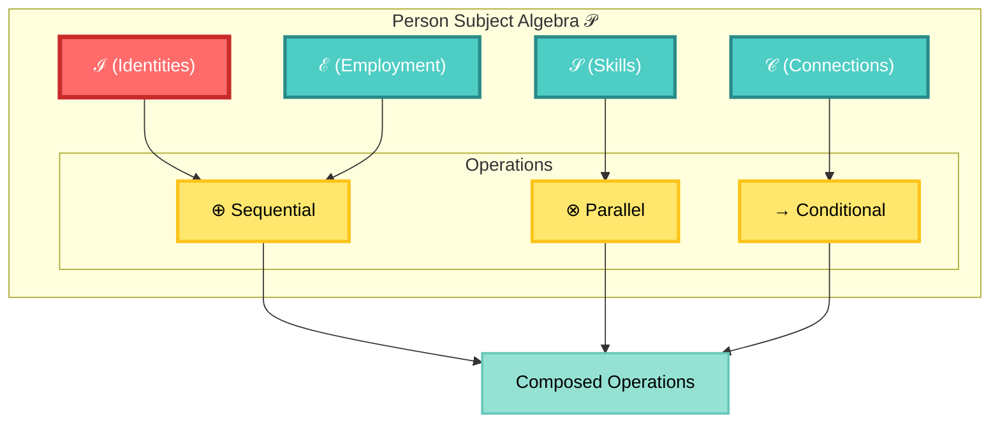

### Mathematical Properties

The algebra satisfies the following fundamental properties:

#### 1. **Monoid Structure** for Sequential Composition
```
(ℐ, ⊕, ε) forms a monoid where:
- ⊕ is associative: (a ⊕ b) ⊕ c = a ⊕ (b ⊕ c)
- ε is the identity element: a ⊕ ε = ε ⊕ a = a
```

#### 2. **Commutative Monoid** for Parallel Composition
```
(ℐ, ⊗, ε) forms a commutative monoid where:
- ⊗ is associative: (a ⊗ b) ⊗ c = a ⊗ (b ⊗ c)
- ⊗ is commutative: a ⊗ b = b ⊗ a (when operations are independent)
- ε is the identity element: a ⊗ ε = ε ⊗ a = a
```

#### 3. **Distributive Laws**
```
Left Distribution:  a ⊕ (b ⊗ c) = (a ⊕ b) ⊗ (a ⊕ c)
Right Distribution: (a ⊗ b) ⊕ c = (a ⊕ c) ⊗ (b ⊕ c)
```

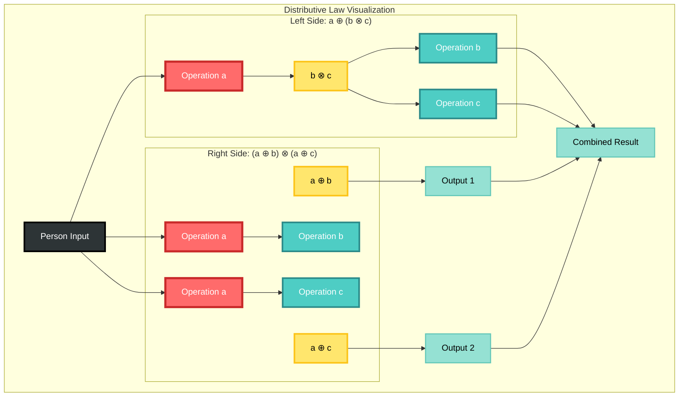

### Subject Structure

```
events.person.{aggregate}.{scope}.{operation}.{entity_id}
```

**Grammar Definition**:
```bnf
<person-subject> ::= "events.person." <aggregate> "." <scope> "." <operation> "." <entity-id>
                   | "commands.person." <aggregate> "." <scope> "." <operation> "." <entity-id>
                   | "queries.person." <aggregate> "." <scope> "." <operation>

<aggregate>    ::= "person" | "identity" | "employment" | "skills" | "network" | "contact" | "preferences" | "demographics"
<scope>        ::= "global" | "user." <user-id> | "org." <org-id> | "team." <team-id> | "region." <region-id> | "dept." <dept-id>
<operation>    ::= <person-op> | <identity-op> | <employment-op> | <skills-op> | <network-op>

<person-op>     ::= "created" | "updated" | "archived" | "reactivated" | "merged" | "split"
<identity-op>   ::= "name_updated" | "birth_date_set" | "death_recorded" | "identifier_added" | "identifier_removed"
<employment-op> ::= "employment_added" | "employment_updated" | "employment_ended" | "role_changed" | "organization_changed"
<skills-op>     ::= "skill_added" | "skill_updated" | "skill_endorsed" | "certification_added" | "certification_expired"
<network-op>    ::= "connection_requested" | "connection_accepted" | "connection_rejected" | "connection_removed"

<entity-id>     ::= <person-id> | <employment-id> | <skill-id> | <connection-id>
<user-id>       ::= [a-zA-Z0-9-_]+
<org-id>        ::= [a-zA-Z0-9-_]+
<team-id>       ::= [a-zA-Z0-9-_]+
<region-id>     ::= [a-zA-Z0-9-_]+
<dept-id>       ::= [a-zA-Z0-9-_]+
```

## Algebraic Operations

### Sequential Composition (⊕)

Sequential processing where output of one operation becomes input of the next.

**Mathematical Definition**:
```
⊕ : ℐ × ℐ → ℐ
A ⊕ B = λx. B(A(x))

Type signature: A : α → β, B : β → γ ⟹ A ⊕ B : α → γ
```

**Properties**:
- **Associativity**: `(A ⊕ B) ⊕ C = A ⊕ (B ⊕ C)`
- **Identity**: `A ⊕ ε = ε ⊕ A = A` where `ε(x) = x`
- **Type Safety**: Input type of B must match output type of A

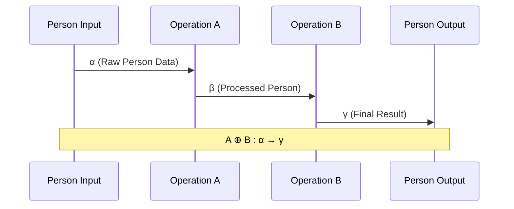

**Example**: Person creation followed by identity verification
```
create_person ⊕ verify_identity : RawPersonData → VerifiedPerson
```

**NATS Subject Flow**:


### Parallel Composition (⊗)

Concurrent processing of independent operations on the same person.

**Mathematical Definition**:
```
⊗ : ℐ × ℐ → ℐ
A ⊗ B = λx. (A(x), B(x))

Type signature: A : α → β, B : α → γ ⟹ A ⊗ B : α → (β × γ)
```

**Properties**:
- **Associativity**: `(A ⊗ B) ⊗ C = A ⊗ (B ⊗ C)`
- **Commutativity**: `A ⊗ B = B ⊗ A` (when operations are independent)
- **Identity**: `A ⊗ ε = A` where `ε` is the identity operation

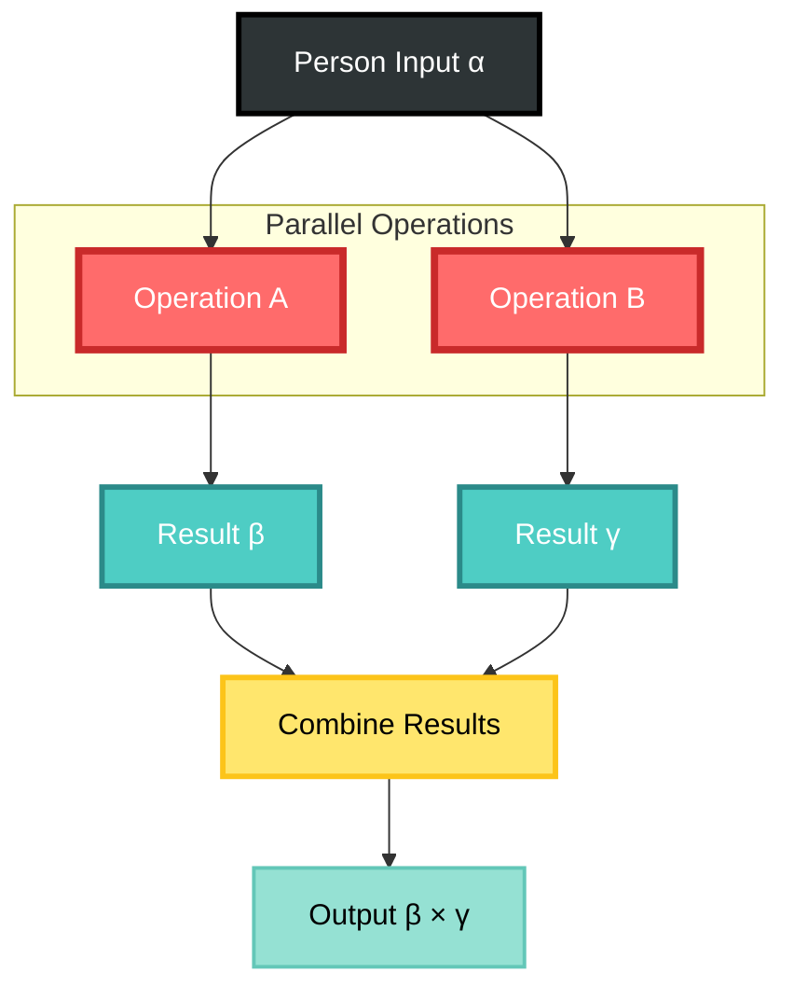

**Example**: Parallel skills assessment and employment verification
```
assess_skills ⊗ verify_employment : Person → (SkillsAssessment × EmploymentVerification)
```

**NATS Subject Flow**:
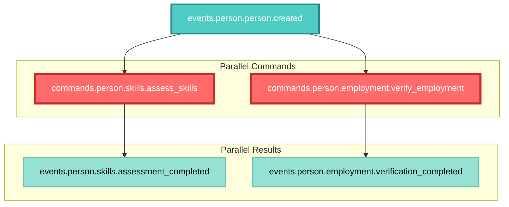

### Conditional Transformation (→)

State-dependent processing based on predicates over person characteristics.

**Mathematical Definition**:
```
→ : ℐ × (ℐ → Bool) × ℐ → ℐ  
A →[P] B = λx. if P(A(x)) then B(A(x)) else A(x)

Type signature: A : α → β, P : β → Bool, B : β → γ ⟹ A →[P] B : α → (β ∨ γ)
```

**Properties**:
- **Idempotence**: `A →[⊤] A = A` where `⊤` is always true
- **Absorption**: `A →[⊥] B = A` where `⊥` is always false  
- **Composition**: `(A →[P] B) →[Q] C = A →[P ∧ Q] (B ⊕ C)`

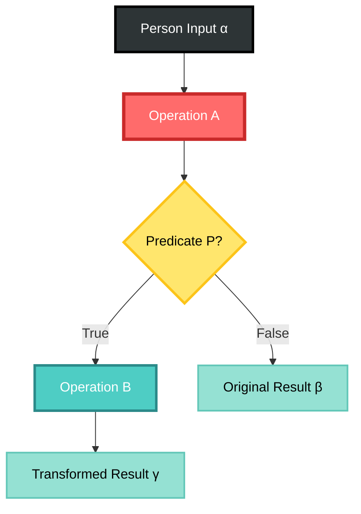

**Example**: Skills certification only if assessment score is high
```
assess_skills →[score > 0.8] certify_skills : Person → (SkillsAssessment ∨ CertifiedPerson)
```

**NATS Subject Flow**:
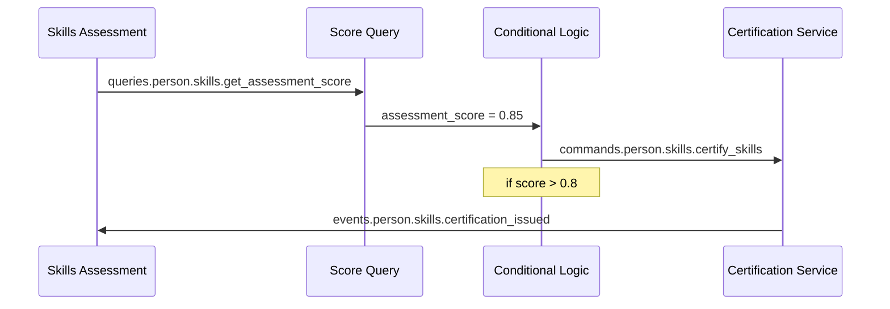

## Subject Categories

### Core Entities

#### 1. Person Subjects
```
events.person.person.{scope}.{action}.{person_id}

Actions:
- created         : Initialize new person
- updated         : Modify person properties
- archived        : Move to inactive status
- reactivated     : Restore from archive
- merged          : Combine multiple person records
- split           : Separate merged person records

Scopes:
- global          : System-wide operations
- user.{id}       : User-scoped operations
- org.{id}        : Organization-scoped
- team.{id}       : Team-scoped
- region.{id}     : Geographic region
- dept.{id}       : Department-scoped
```

#### 2. Identity Subjects
```
events.person.identity.{scope}.{verification}.{person_id}

Verification Types:
- name_updated           : Legal name changes
- birth_date_set         : Date of birth verification
- death_recorded         : Death certificate processing
- identifier_added       : Social security, passport, etc.
- identifier_removed     : Remove expired identifiers
- identity_verified      : Complete identity verification
- documents_validated    : Supporting document validation
```

#### 3. Employment Subjects
```
events.person.employment.{scope}.{lifecycle}.{employment_id}

Employment Lifecycle:
- employment_added       : New employment relationship
- employment_updated     : Role or status changes
- employment_ended       : Termination or resignation
- role_changed          : Job title or responsibility updates
- organization_changed   : Company transfers
- salary_updated        : Compensation adjustments
- benefits_enrolled     : Benefits package selection
```

#### 4. Skills Subjects
```
events.person.skills.{scope}.{assessment}.{skill_id}

Skills Operations:
- skill_added           : New skill registered
- skill_updated         : Proficiency level changes
- skill_endorsed        : Peer endorsements
- skill_removed         : Skill no longer relevant
- certification_added   : Professional certifications
- certification_expired : Certificate expiration
- assessment_completed  : Skills assessment results
```

#### 5. Network Subjects
```
events.person.network.{scope}.{connection}.{connection_id}

Network Operations:
- connection_requested  : New connection request
- connection_accepted   : Connection approval
- connection_rejected   : Connection denial
- connection_removed    : Network relationship ended
- network_analyzed      : Social graph analysis
- influence_calculated  : Network influence metrics
- community_detected    : Community membership
```

#### 6. Contact Subjects
```
events.person.contact.{scope}.{method}.{contact_id}

Contact Methods:
- email_added          : Email address registration
- phone_added          : Phone number registration
- address_added        : Physical address
- contact_verified     : Verification completed
- contact_updated      : Contact information changes
- contact_removed      : Contact method deactivated
```

### Specialized Categories

#### Privacy and Compliance
```
events.person.privacy.{scope}.{operation}.{person_id}

Privacy Operations:
- consent_given        : Privacy consent granted
- consent_revoked      : Privacy consent withdrawn
- data_export_requested: GDPR data export
- data_deletion_requested: Right to be forgotten
- privacy_settings_updated: Privacy preference changes
```

#### Organizational Context
```
events.person.{aggregate}.org.{org_id}.{operation}.{entity_id}

Organization-Scoped Examples:
- events.person.employment.org.acme.employment_added.emp123
- events.person.skills.org.techcorp.assessment_completed.skill456
- events.person.network.org.startup.connection_accepted.conn789
```

#### Geographic Context
```
events.person.{aggregate}.region.{region_id}.{operation}.{entity_id}

Region-Scoped Examples:
- events.person.person.region.us_west.created.person123
- events.person.employment.region.europe.employment_added.emp456
- events.person.network.region.asia.connection_requested.conn789
```

## Composition Rules

### 1. Sequential Processing Rules

**Dependency Rule**: Operation B can only start after operation A completes
```
A ⊕ B requires: completed(A) → start(B)
```

**Data Flow Rule**: Output type of A must match input type of B
```
type(output(A)) = type(input(B))
```

**Error Propagation**: Failure in A prevents execution of B
```
failed(A) → cancel(B)
```

### 2. Parallel Processing Rules

**Independence Rule**: Operations can execute concurrently
```
A ⊗ B requires: independent(A, B)
```

**Resource Rule**: Combined resource usage must be within limits
```
resources(A) + resources(B) ≤ system_capacity
```

**Synchronization Rule**: Results are combined when both complete
```
result(A ⊗ B) = combine(result(A), result(B))
```

### 3. Conditional Rules

**Predicate Rule**: Condition must be evaluable before transformation
```
A →[P] B requires: evaluable(P, state(A))
```

**Type Safety**: Conditional transformation preserves type safety
```
A →[P] B : type(A) → type(A) ∨ type(B)
```

## Person Identity Workflows

### 1. Person Onboarding Pipeline

**Mathematical Definition**:
```
OnboardingPipeline = create_person ⊕ validate_identity ⊕ 
                     (verify_documents ⊗ collect_preferences) ⊕ 
                     (assessment_required →[new_employee] assess_skills) ⊕ 
                     (setup_access →[identity_verified] provision_systems) ⊕ 
                     finalize_onboarding

Type: RawPersonData → OnboardedPerson
```

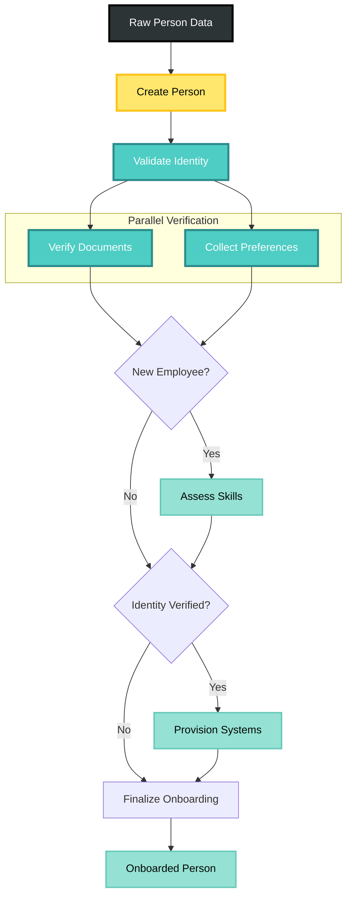

**NATS Subject Flow**:
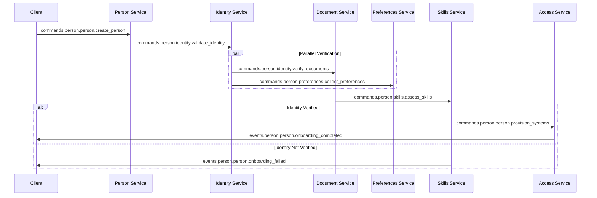

### 2. Employment Lifecycle Pipeline

**Mathematical Definition**:
```
EmploymentPipeline = initialize_employment ⊕ background_check ⊕
                     (hr_approval ⊗ legal_compliance) ⊕
                     create_employment_record ⊕
                     (provision_it ⊗ enroll_benefits ⊗ setup_payroll) ⊕
                     complete_employment_setup

Type: EmploymentRequest → ActiveEmployment
```

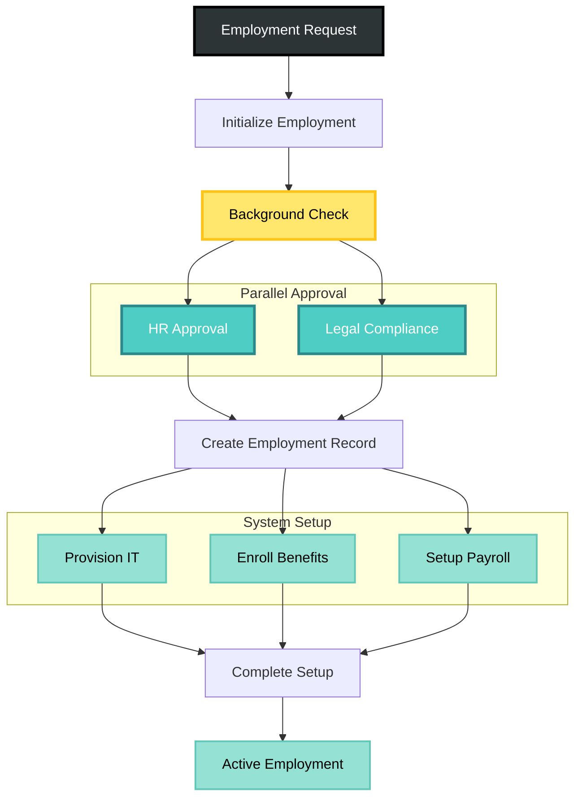

### 3. Skills Certification Pipeline

**Mathematical Definition**:
```
SkillsPipeline = initiate_assessment ⊕ conduct_evaluation ⊕
                 (peer_review ⊗ expert_validation) ⊕
                 (score_threshold →[score ≥ 0.8] issue_certification) ⊕
                 update_skill_profile ⊕
                 notify_completion

Type: SkillsRequest → CertifiedSkills
```

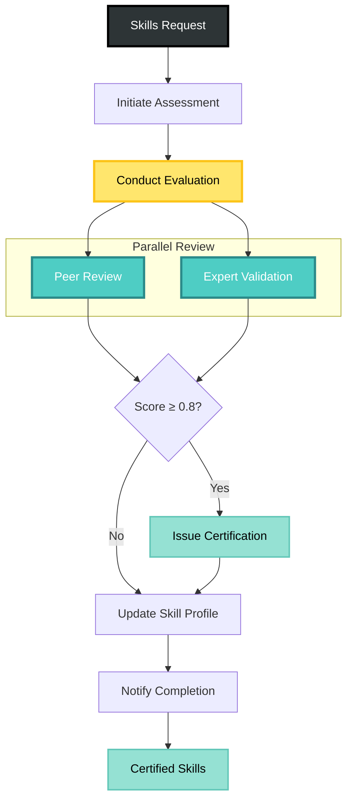

### 4. Privacy Compliance Pipeline

**Mathematical Definition**:
```
PrivacyPipeline = receive_request ⊕ validate_identity ⊕
                  (request_type →[export] export_data) ⊕
                  (request_type →[deletion] delete_data) ⊕
                  audit_compliance ⊕
                  notify_completion

Type: PrivacyRequest → ComplianceResult
```

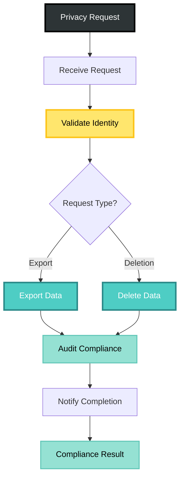

### 5. Network Analysis Pipeline

**Mathematical Definition**:
```
NetworkPipeline = collect_connections ⊕ build_graph ⊕
                  (centrality_analysis ⊗ community_detection) ⊕
                  (influence_calculation ⊗ recommendation_generation) ⊕
                  update_network_metrics

Type: PersonConnections → NetworkAnalysis
```

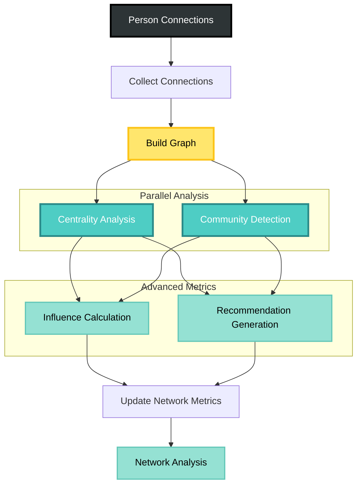

## Algebraic Transformations

### 1. Identity Transformations
```
I(x) = x
Subject: events.person.person.identity.x
```

### 2. Status Transformations
```
activate : ArchivedPerson → ActivePerson
Subject: commands.person.person.reactivate

archive : ActivePerson → ArchivedPerson  
Subject: commands.person.person.archive
```

### 3. Verification Transformations
```
verify_identity : UnverifiedPerson → VerifiedPerson
Subject: commands.person.identity.verify_identity

verify_employment : Person → PersonWithEmployment
Subject: commands.person.employment.verify_employment
```

### 4. Skills Transformations
```
assess_skills : Person → PersonWithSkills
Subject: commands.person.skills.assess_skills

certify_skill : SkillAssessment → CertifiedSkill
Subject: commands.person.skills.certify_skill
```

### 5. Network Transformations
```
connect : (Person, Person) → Connection
Subject: commands.person.network.request_connection

analyze_network : PersonConnections → NetworkMetrics
Subject: commands.person.network.analyze_network
```

### 6. Privacy Transformations
```
export_data : Person → PersonDataExport
Subject: commands.person.privacy.export_data

anonymize : Person → AnonymizedPerson
Subject: commands.person.privacy.anonymize_data
```

### 7. Organizational Transformations
```
hire : (Person, Organization) → Employee
Subject: commands.person.employment.org.{org_id}.hire

transfer : (Employee, Department) → Employee
Subject: commands.person.employment.org.{org_id}.transfer
```

### 8. Inverse Operations
```
archive⁻¹ = reactivate
merge⁻¹ = split
hire⁻¹ = terminate
connect⁻¹ = disconnect
certify⁻¹ = revoke_certification
```

**Inverse Subject Pattern**:
```
commands.person.person.reactivate         [inverse of archive]
commands.person.person.split              [inverse of merge]
commands.person.employment.terminate      [inverse of hire]
commands.person.network.disconnect        [inverse of connect]
```

## Type System and Safety

### Person Type Hierarchy

The Person Domain defines a rigorous type system that ensures compile-time safety for all identity operations:

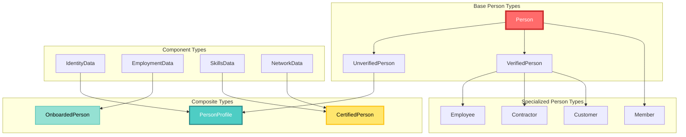

### Type Safety Rules

#### 1. **Input-Output Compatibility**
```
∀ operations A, B: A ⊕ B is valid iff output_type(A) ⊆ input_type(B)

Example:
create_person : RawPersonData → UnverifiedPerson
verify_identity : UnverifiedPerson → VerifiedPerson
∴ create_person ⊕ verify_identity : RawPersonData → VerifiedPerson ✓
```

#### 2. **Parallel Operation Compatibility**
```
∀ operations A, B: A ⊗ B is valid iff input_type(A) = input_type(B)

Example:
verify_identity : UnverifiedPerson → VerifiedPerson
collect_preferences : UnverifiedPerson → PersonWithPreferences
∴ verify_identity ⊗ collect_preferences : UnverifiedPerson → (VerifiedPerson × PersonWithPreferences) ✓
```

#### 3. **Conditional Type Safety**
```
∀ operations A, B, predicate P: A →[P] B is valid iff:
  - P : output_type(A) → Bool
  - output_type(A) ⊆ input_type(B)

Example:
assess_skills : Person → PersonWithSkills
certify_skills : PersonWithSkills → CertifiedPerson
high_score : PersonWithSkills → Bool
∴ assess_skills →[high_score] certify_skills : Person → (PersonWithSkills ∨ CertifiedPerson) ✓
```

### Algebraic Optimization Rules

The algebra enables compile-time optimization through proven mathematical equivalences:

#### **Fusion Laws**
```
(A ⊕ B) ⊕ C = A ⊕ (B ⊕ C)                    [Associativity]
A ⊗ B = B ⊗ A                                 [Commutativity - when independent]
A ⊕ (B ⊗ C) = (A ⊕ B) ⊗ (A ⊕ C)             [Left Distributivity]
```

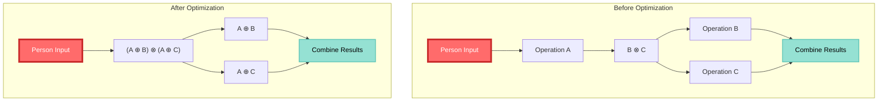

## Correctness Proofs

### Theorem 1: Sequential Composition Associativity
**Statement**: `(A ⊕ B) ⊕ C = A ⊕ (B ⊕ C)`

**Proof**:
```
Let f = A, g = B, h = C
(f ⊕ g) ⊕ h = λx. h((f ⊕ g)(x))
             = λx. h(g(f(x)))
             
f ⊕ (g ⊕ h) = λx. (g ⊕ h)(f(x))
             = λx. h(g(f(x)))
             
∴ (f ⊕ g) ⊕ h = f ⊕ (g ⊕ h) ∎
```

### Theorem 2: Parallel Composition Commutativity
**Statement**: `A ⊗ B = B ⊗ A` (when operations are independent)

**Proof**:
```
A ⊗ B = λx. (A(x), B(x))
B ⊗ A = λx. (B(x), A(x))

Since (a, b) ≅ (b, a) in the product type (up to isomorphism),
and operations are independent (no shared mutable state):
∴ A ⊗ B = B ⊗ A ∎
```

### Theorem 3: Distributive Law
**Statement**: `A ⊕ (B ⊗ C) = (A ⊕ B) ⊗ (A ⊕ C)`

**Proof**:
```
A ⊕ (B ⊗ C) = λx. (B ⊗ C)(A(x))
              = λx. (B(A(x)), C(A(x)))
              
(A ⊕ B) ⊗ (A ⊕ C) = λx. ((A ⊕ B)(x), (A ⊕ C)(x))
                    = λx. (B(A(x)), C(A(x)))
                    
∴ A ⊕ (B ⊗ C) = (A ⊕ B) ⊗ (A ⊕ C) ∎
```

This Person Subject Algebra provides:

1. **Mathematical Rigor**: Formal definitions with proven properties
2. **Type Safety**: Compile-time guarantees for person management pipelines  
3. **Composability**: Well-defined rules for combining identity operations
4. **Optimization**: Algebraic laws enabling automatic optimization
5. **Correctness**: Mathematical proofs of key properties
6. **Distributed Processing**: NATS-based implementation of algebraic operations
7. **Privacy Compliance**: Built-in privacy and compliance workflows
8. **Cross-Domain Integration**: Seamless integration with other CIM domains

The algebra serves as both a theoretical foundation and practical framework for building reliable, scalable person management systems within the CIM ecosystem, with particular emphasis on identity verification, employment lifecycle management, skills certification, and privacy compliance.