<!--
Copyright 2025 Cowboy AI, LLC.
SPDX-License-Identifier: MIT
-->

# CIM Person Domain - Subject Algebra

## Table of Contents

### NATS Subject Algebra
- [Overview](#overview)
- [Person Subject Algebra](#person-subject-algebra)
- [Algebraic Operations](#algebraic-operations)
- [Subject Categories](#subject-categories)
- [Composition Rules](#composition-rules)
- [Person Identity Workflows](#person-identity-workflows)
- [Algebraic Transformations](#algebraic-transformations)

### Category Theory Algebra
- [PersonAttribute Category Theory Algebra](#personattribute-category-theory-algebra)
  - [Functor Structure](#functor-structure-personattribute)
  - [Monad Structure](#monad-structure-temporalvalidity)
  - [Free Monad](#free-monad-personattributeset)
  - [Coalgebra](#coalgebra-person-unfold)
  - [Cross-Domain Functors](#cross-domain-functors)
  - [Provenance Tracking](#provenance-as-traced-category)
  - [Laws and Proofs](#laws-and-proofs)

## Overview

The CIM Person Domain defines a formal Subject Algebra that captures the mathematical relationships between person entities, their identity transformations, and lifecycle workflows. This algebra provides a rigorous foundation for person management operations while maintaining composability and predictable behavior.

This algebra extends beyond simple hierarchical naming to provide:
- **Mathematical rigor** for identity operation composition and verification
- **Type safety** guarantees for person management pipelines
- **Formal semantics** for distributed person processing workflows
- **Algebraic laws** that enable optimization and reasoning about identity operations

## Person Subject Algebra

### Formal Definition

The Person Subject Algebra is defined as a 7-tuple:

```
𝒫 = (ℐ, ℰ, 𝒮, 𝒞, ⊕, ⊗, →)
```

Where:
- `ℐ` (Identities): Set of all person identities and their verification states
- `ℰ` (Employment): Set of all employment relationships and lifecycle operations
- `𝒮` (Skills): Set of all skill assessments, certifications, and endorsements
- `𝒞` (Connections): Set of all network relationships and social connections
- `⊕` (Sequential Composition): Binary operation for sequential identity processing
- `⊗` (Parallel Composition): Binary operation for parallel person operations  
- `→` (Conditional Transformation): Mapping between person states with predicates

```mermaid
graph TB
    subgraph "Person Subject Algebra 𝒫"
        I["ℐ (Identities)"]
        E["ℰ (Employment)"]
        S["𝒮 (Skills)"]
        C["𝒞 (Connections)"]
        
        subgraph "Operations"
            SEQ["⊕ Sequential"]
            PAR["⊗ Parallel"]
            COND["→ Conditional"]
        end
    end
    
    I --> SEQ
    E --> SEQ
    S --> PAR
    C --> COND
    
    SEQ --> RESULT["Composed Operations"]
    PAR --> RESULT
    COND --> RESULT
    
    style I fill:#FF6B6B,stroke:#C92A2A,stroke-width:4px,color:#FFF
    style E fill:#4ECDC4,stroke:#2B8A89,stroke-width:3px,color:#FFF
    style S fill:#4ECDC4,stroke:#2B8A89,stroke-width:3px,color:#FFF
    style C fill:#4ECDC4,stroke:#2B8A89,stroke-width:3px,color:#FFF
    style SEQ fill:#FFE66D,stroke:#FCC419,stroke-width:3px,color:#000
    style PAR fill:#FFE66D,stroke:#FCC419,stroke-width:3px,color:#000
    style COND fill:#FFE66D,stroke:#FCC419,stroke-width:3px,color:#000
    style RESULT fill:#95E1D3,stroke:#63C7B8,stroke-width:2px,color:#000
```



### Mathematical Properties

The algebra satisfies the following fundamental properties:

#### 1. **Monoid Structure** for Sequential Composition
```
(ℐ, ⊕, ε) forms a monoid where:
- ⊕ is associative: (a ⊕ b) ⊕ c = a ⊕ (b ⊕ c)
- ε is the identity element: a ⊕ ε = ε ⊕ a = a
```

#### 2. **Commutative Monoid** for Parallel Composition
```
(ℐ, ⊗, ε) forms a commutative monoid where:
- ⊗ is associative: (a ⊗ b) ⊗ c = a ⊗ (b ⊗ c)
- ⊗ is commutative: a ⊗ b = b ⊗ a (when operations are independent)
- ε is the identity element: a ⊗ ε = ε ⊗ a = a
```

#### 3. **Distributive Laws**
```
Left Distribution:  a ⊕ (b ⊗ c) = (a ⊕ b) ⊗ (a ⊕ c)
Right Distribution: (a ⊗ b) ⊕ c = (a ⊕ c) ⊗ (b ⊕ c)
```


### Subject Structure

```
events.person.{aggregate}.{scope}.{operation}.{entity_id}
```

**Grammar Definition**:
```bnf
<person-subject> ::= "events.person." <aggregate> "." <scope> "." <operation> "." <entity-id>
                   | "commands.person." <aggregate> "." <scope> "." <operation> "." <entity-id>
                   | "queries.person." <aggregate> "." <scope> "." <operation>

<aggregate>    ::= "person" | "identity" | "employment" | "skills" | "network" | "contact" | "preferences" | "demographics"
<scope>        ::= "global" | "user." <user-id> | "org." <org-id> | "team." <team-id> | "region." <region-id> | "dept." <dept-id>
<operation>    ::= <person-op> | <identity-op> | <employment-op> | <skills-op> | <network-op>

<person-op>     ::= "created" | "updated" | "archived" | "reactivated" | "merged" | "split"
<identity-op>   ::= "name_updated" | "birth_date_set" | "death_recorded" | "identifier_added" | "identifier_removed"
<employment-op> ::= "employment_added" | "employment_updated" | "employment_ended" | "role_changed" | "organization_changed"
<skills-op>     ::= "skill_added" | "skill_updated" | "skill_endorsed" | "certification_added" | "certification_expired"
<network-op>    ::= "connection_requested" | "connection_accepted" | "connection_rejected" | "connection_removed"

<entity-id>     ::= <person-id> | <employment-id> | <skill-id> | <connection-id>
<user-id>       ::= [a-zA-Z0-9-_]+
<org-id>        ::= [a-zA-Z0-9-_]+
<team-id>       ::= [a-zA-Z0-9-_]+
<region-id>     ::= [a-zA-Z0-9-_]+
<dept-id>       ::= [a-zA-Z0-9-_]+
```

## Algebraic Operations

### Sequential Composition (⊕)

Sequential processing where output of one operation becomes input of the next.

**Mathematical Definition**:
```
⊕ : ℐ × ℐ → ℐ
A ⊕ B = λx. B(A(x))

Type signature: A : α → β, B : β → γ ⟹ A ⊕ B : α → γ
```

**Properties**:
- **Associativity**: `(A ⊕ B) ⊕ C = A ⊕ (B ⊕ C)`
- **Identity**: `A ⊕ ε = ε ⊕ A = A` where `ε(x) = x`
- **Type Safety**: Input type of B must match output type of A

```mermaid
sequenceDiagram
    participant Input as Person Input
    participant OpA as Operation A
    participant OpB as Operation B  
    participant Output as Person Output
    
    Input->>OpA: α (Raw Person Data)
    OpA->>OpB: β (Processed Person)
    OpB->>Output: γ (Final Result)
    
    Note over Input,Output: A ⊕ B : α → γ
```



**Example**: Person creation followed by identity verification
```
create_person ⊕ verify_identity : RawPersonData → VerifiedPerson
```

**NATS Subject Flow**:


### Parallel Composition (⊗)

Concurrent processing of independent operations on the same person.

**Mathematical Definition**:
```
⊗ : ℐ × ℐ → ℐ
A ⊗ B = λx. (A(x), B(x))

Type signature: A : α → β, B : α → γ ⟹ A ⊗ B : α → (β × γ)
```

**Properties**:
- **Associativity**: `(A ⊗ B) ⊗ C = A ⊗ (B ⊗ C)`
- **Commutativity**: `A ⊗ B = B ⊗ A` (when operations are independent)
- **Identity**: `A ⊗ ε = A` where `ε` is the identity operation

```mermaid
graph TB
    INPUT[Person Input α]
    
    subgraph "Parallel Operations"
        A[Operation A]
        B[Operation B]
    end
    
    RESULT_A[Result β]
    RESULT_B[Result γ]
    COMBINE[Combine Results]
    OUTPUT[Output β × γ]
    
    INPUT --> A
    INPUT --> B
    A --> RESULT_A
    B --> RESULT_B
    RESULT_A --> COMBINE
    RESULT_B --> COMBINE
    COMBINE --> OUTPUT
    
    style INPUT fill:#2D3436,stroke:#000,stroke-width:3px,color:#FFF
    style A fill:#FF6B6B,stroke:#C92A2A,stroke-width:4px,color:#FFF
    style B fill:#FF6B6B,stroke:#C92A2A,stroke-width:4px,color:#FFF
    style RESULT_A fill:#4ECDC4,stroke:#2B8A89,stroke-width:3px,color:#FFF
    style RESULT_B fill:#4ECDC4,stroke:#2B8A89,stroke-width:3px,color:#FFF
    style COMBINE fill:#FFE66D,stroke:#FCC419,stroke-width:3px,color:#000
    style OUTPUT fill:#95E1D3,stroke:#63C7B8,stroke-width:2px,color:#000
```



**Example**: Parallel skills assessment and employment verification
```
assess_skills ⊗ verify_employment : Person → (SkillsAssessment × EmploymentVerification)
```

**NATS Subject Flow**:


### Conditional Transformation (→)

State-dependent processing based on predicates over person characteristics.

**Mathematical Definition**:
```
→ : ℐ × (ℐ → Bool) × ℐ → ℐ 
A →[P] B = λx. if P(A(x)) then B(A(x)) else A(x)

Type signature: A : α → β, P : β → Bool, B : β → γ ⟹ A →[P] B : α → (β ∨ γ)
```

**Properties**:
- **Idempotence**: `A →[⊤] A = A` where `⊤` is always true
- **Absorption**: `A →[⊥] B = A` where `⊥` is always false  
- **Composition**: `(A →[P] B) →[Q] C = A →[P ∧ Q] (B ⊕ C)`


**Example**: Skills certification only if assessment score is high
```
assess_skills →[score > 0.8] certify_skills : Person → (SkillsAssessment ∨ CertifiedPerson)
```

**NATS Subject Flow**:


## Subject Categories

### Core Entities

#### 1. Person Subjects
```
events.person.person.{scope}.{action}.{person_id}

Actions:
- created         : Initialize new person
- updated         : Modify person properties
- archived        : Move to inactive status
- reactivated     : Restore from archive
- merged          : Combine multiple person records
- split           : Separate merged person records

Scopes:
- global          : System-wide operations
- user.{id}       : User-scoped operations
- org.{id}        : Organization-scoped
- team.{id}       : Team-scoped
- region.{id}     : Geographic region
- dept.{id}       : Department-scoped
```

#### 2. Identity Subjects
```
events.person.identity.{scope}.{verification}.{person_id}

Verification Types:
- name_updated           : Legal name changes
- birth_date_set         : Date of birth verification
- death_recorded         : Death certificate processing
- identifier_added       : Social security, passport, etc.
- identifier_removed     : Remove expired identifiers
- identity_verified      : Complete identity verification
- documents_validated    : Supporting document validation
```

#### 3. Employment Subjects
```
events.person.employment.{scope}.{lifecycle}.{employment_id}

Employment Lifecycle:
- employment_added       : New employment relationship
- employment_updated     : Role or status changes
- employment_ended       : Termination or resignation
- role_changed          : Job title or responsibility updates
- organization_changed   : Company transfers
- salary_updated        : Compensation adjustments
- benefits_enrolled     : Benefits package selection
```

#### 4. Skills Subjects
```
events.person.skills.{scope}.{assessment}.{skill_id}

Skills Operations:
- skill_added           : New skill registered
- skill_updated         : Proficiency level changes
- skill_endorsed        : Peer endorsements
- skill_removed         : Skill no longer relevant
- certification_added   : Professional certifications
- certification_expired : Certificate expiration
- assessment_completed  : Skills assessment results
```

#### 5. Network Subjects
```
events.person.network.{scope}.{connection}.{connection_id}

Network Operations:
- connection_requested  : New connection request
- connection_accepted   : Connection approval
- connection_rejected   : Connection denial
- connection_removed    : Network relationship ended
- network_analyzed      : Social graph analysis
- influence_calculated  : Network influence metrics
- community_detected    : Community membership
```

#### 6. Contact Subjects
```
events.person.contact.{scope}.{method}.{contact_id}

Contact Methods:
- email_added          : Email address registration
- phone_added          : Phone number registration
- address_added        : Physical address
- contact_verified     : Verification completed
- contact_updated      : Contact information changes
- contact_removed      : Contact method deactivated
```

### Specialized Categories

#### Privacy and Compliance
```
events.person.privacy.{scope}.{operation}.{person_id}

Privacy Operations:
- consent_given        : Privacy consent granted
- consent_revoked      : Privacy consent withdrawn
- data_export_requested: GDPR data export
- data_deletion_requested: Right to be forgotten
- privacy_settings_updated: Privacy preference changes
```

#### Organizational Context
```
events.person.{aggregate}.org.{org_id}.{operation}.{entity_id}

Organization-Scoped Examples:
- events.person.employment.org.acme.employment_added.emp123
- events.person.skills.org.techcorp.assessment_completed.skill456
- events.person.network.org.startup.connection_accepted.conn789
```

#### Geographic Context
```
events.person.{aggregate}.region.{region_id}.{operation}.{entity_id}

Region-Scoped Examples:
- events.person.person.region.us_west.created.person123
- events.person.employment.region.europe.employment_added.emp456
- events.person.network.region.asia.connection_requested.conn789
```

## Composition Rules

### 1. Sequential Processing Rules

**Dependency Rule**: Operation B can only start after operation A completes
```
A ⊕ B requires: completed(A) → start(B)
```

**Data Flow Rule**: Output type of A must match input type of B
```
type(output(A)) = type(input(B))
```

**Error Propagation**: Failure in A prevents execution of B
```
failed(A) → cancel(B)
```

### 2. Parallel Processing Rules

**Independence Rule**: Operations can execute concurrently
```
A ⊗ B requires: independent(A, B)
```

**Resource Rule**: Combined resource usage must be within limits
```
resources(A) + resources(B) ≤ system_capacity
```

**Synchronization Rule**: Results are combined when both complete
```
result(A ⊗ B) = combine(result(A), result(B))
```

### 3. Conditional Rules

**Predicate Rule**: Condition must be evaluable before transformation
```
A →[P] B requires: evaluable(P, state(A))
```

**Type Safety**: Conditional transformation preserves type safety
```
A →[P] B : type(A) → type(A) ∨ type(B)
```

## Person Identity Workflows

### 1. Person Onboarding Pipeline

**Mathematical Definition**:
```
OnboardingPipeline = create_person ⊕ validate_identity ⊕ 
                     (verify_documents ⊗ collect_preferences) ⊕ 
                     (assessment_required →[new_employee] assess_skills) ⊕ 
                     (setup_access →[identity_verified] provision_systems) ⊕ 
                     finalize_onboarding

Type: RawPersonData → OnboardedPerson
```


**NATS Subject Flow**:


### 2. Employment Lifecycle Pipeline

**Mathematical Definition**:
```
EmploymentPipeline = initialize_employment ⊕ background_check ⊕
                     (hr_approval ⊗ legal_compliance) ⊕
                     create_employment_record ⊕
                     (provision_it ⊗ enroll_benefits ⊗ setup_payroll) ⊕
                     complete_employment_setup

Type: EmploymentRequest → ActiveEmployment
```


### 3. Skills Certification Pipeline

**Mathematical Definition**:
```
SkillsPipeline = initiate_assessment ⊕ conduct_evaluation ⊕
                 (peer_review ⊗ expert_validation) ⊕
                 (score_threshold →[score ≥ 0.8] issue_certification) ⊕
                 update_skill_profile ⊕
                 notify_completion

Type: SkillsRequest → CertifiedSkills
```



```mermaid
graph TB
    START[Skills Request]
    INITIATE[Initiate Assessment]
    EVALUATE[Conduct Evaluation]
    
    subgraph "Parallel Review"
        PEER[Peer Review]
        EXPERT[Expert Validation]
    end
    
    THRESHOLD{Score ≥ 0.8?}
    CERTIFY[Issue Certification]
    UPDATE[Update Skill Profile]
    NOTIFY[Notify Completion]
    END[Certified Skills]
    
    START --> INITIATE
    INITIATE --> EVALUATE
    EVALUATE --> PEER
    EVALUATE --> EXPERT
    PEER --> THRESHOLD
    EXPERT --> THRESHOLD
    THRESHOLD -->|Yes| CERTIFY
    THRESHOLD -->|No| UPDATE
    CERTIFY --> UPDATE
    UPDATE --> NOTIFY
    NOTIFY --> END
    
    style START fill:#2D3436,stroke:#000,stroke-width:3px,color:#FFF
    style EVALUATE fill:#FFE66D,stroke:#FCC419,stroke-width:3px,color:#000
    style PEER fill:#4ECDC4,stroke:#2B8A89,stroke-width:3px,color:#FFF
    style EXPERT fill:#4ECDC4,stroke:#2B8A89,stroke-width:3px,color:#FFF
    style CERTIFY fill:#95E1D3,stroke:#63C7B8,stroke-width:2px,color:#000
    style END fill:#95E1D3,stroke:#63C7B8,stroke-width:2px,color:#000
```

### 4. Privacy Compliance Pipeline

**Mathematical Definition**:
```
PrivacyPipeline = receive_request ⊕ validate_identity ⊕
                  (request_type →[export] export_data) ⊕
                  (request_type →[deletion] delete_data) ⊕
                  audit_compliance ⊕
                  notify_completion

Type: PrivacyRequest → ComplianceResult
```


### 5. Network Analysis Pipeline

**Mathematical Definition**:
```
NetworkPipeline = collect_connections ⊕ build_graph ⊕
                  (centrality_analysis ⊗ community_detection) ⊕
                  (influence_calculation ⊗ recommendation_generation) ⊕
                  update_network_metrics

Type: PersonConnections → NetworkAnalysis
```


## Algebraic Transformations

### 1. Identity Transformations
```
I(x) = x
Subject: events.person.person.identity.x
```

### 2. Status Transformations
```
activate : ArchivedPerson → ActivePerson
Subject: commands.person.person.reactivate

archive : ActivePerson → ArchivedPerson  
Subject: commands.person.person.archive
```

### 3. Verification Transformations
```
verify_identity : UnverifiedPerson → VerifiedPerson
Subject: commands.person.identity.verify_identity

verify_employment : Person → PersonWithEmployment
Subject: commands.person.employment.verify_employment
```

### 4. Skills Transformations
```
assess_skills : Person → PersonWithSkills
Subject: commands.person.skills.assess_skills

certify_skill : SkillAssessment → CertifiedSkill
Subject: commands.person.skills.certify_skill
```

### 5. Network Transformations
```
connect : (Person, Person) → Connection
Subject: commands.person.network.request_connection

analyze_network : PersonConnections → NetworkMetrics
Subject: commands.person.network.analyze_network
```

### 6. Privacy Transformations
```
export_data : Person → PersonDataExport
Subject: commands.person.privacy.export_data

anonymize : Person → AnonymizedPerson
Subject: commands.person.privacy.anonymize_data
```

### 7. Organizational Transformations
```
hire : (Person, Organization) → Employee
Subject: commands.person.employment.org.{org_id}.hire

transfer : (Employee, Department) → Employee
Subject: commands.person.employment.org.{org_id}.transfer
```

### 8. Inverse Operations
```
archive⁻¹ = reactivate
merge⁻¹ = split
hire⁻¹ = terminate
connect⁻¹ = disconnect
certify⁻¹ = revoke_certification
```

**Inverse Subject Pattern**:
```
commands.person.person.reactivate         [inverse of archive]
commands.person.person.split              [inverse of merge]
commands.person.employment.terminate      [inverse of hire]
commands.person.network.disconnect        [inverse of connect]
```

## Type System and Safety

### Person Type Hierarchy

The Person Domain defines a rigorous type system that ensures compile-time safety for all identity operations:


### Type Safety Rules

#### 1. **Input-Output Compatibility**
```
∀ operations A, B: A ⊕ B is valid iff output_type(A) ⊆ input_type(B)

Example:
create_person : RawPersonData → UnverifiedPerson
verify_identity : UnverifiedPerson → VerifiedPerson
∴ create_person ⊕ verify_identity : RawPersonData → VerifiedPerson ✓
```

#### 2. **Parallel Operation Compatibility**
```
∀ operations A, B: A ⊗ B is valid iff input_type(A) = input_type(B)

Example:
verify_identity : UnverifiedPerson → VerifiedPerson
collect_preferences : UnverifiedPerson → PersonWithPreferences
∴ verify_identity ⊗ collect_preferences : UnverifiedPerson → (VerifiedPerson × PersonWithPreferences) ✓
```

#### 3. **Conditional Type Safety**
```
∀ operations A, B, predicate P: A →[P] B is valid iff:
  - P : output_type(A) → Bool
  - output_type(A) ⊆ input_type(B)

Example:
assess_skills : Person → PersonWithSkills
certify_skills : PersonWithSkills → CertifiedPerson
high_score : PersonWithSkills → Bool
∴ assess_skills →[high_score] certify_skills : Person → (PersonWithSkills ∨ CertifiedPerson) ✓
```

### Algebraic Optimization Rules

The algebra enables compile-time optimization through proven mathematical equivalences:

#### **Fusion Laws**
```
(A ⊕ B) ⊕ C = A ⊕ (B ⊕ C)                    [Associativity]
A ⊗ B = B ⊗ A                                 [Commutativity - when independent]
A ⊕ (B ⊗ C) = (A ⊕ B) ⊗ (A ⊕ C)             [Left Distributivity]
```



```mermaid
graph TB
    subgraph "Before Optimization"
        INPUT1[Person Input]
        OP_A1[Operation A]
        PAR1[B ⊗ C]
        OP_B1[Operation B]
        OP_C1[Operation C]
        COMBINE1[Combine Results]
    end
    
    subgraph "After Optimization"
        INPUT2[Person Input]
        PAR2["(A ⊕ B) ⊗ (A ⊕ C)"]
        SEQ1[A ⊕ B]
        SEQ2[A ⊕ C]
        COMBINE2[Combine Results]
    end
    
    INPUT1 --> OP_A1
    OP_A1 --> PAR1
    PAR1 --> OP_B1
    PAR1 --> OP_C1
    OP_B1 --> COMBINE1
    OP_C1 --> COMBINE1
    
    INPUT2 --> PAR2
    PAR2 --> SEQ1
    PAR2 --> SEQ2
    SEQ1 --> COMBINE2
    SEQ2 --> COMBINE2
    
    style INPUT1 fill:#FF6B6B,stroke:#C92A2A,stroke-width:4px,color:#FFF
    style INPUT2 fill:#FF6B6B,stroke:#C92A2A,stroke-width:4px,color:#FFF
    style COMBINE1 fill:#95E1D3,stroke:#63C7B8,stroke-width:2px,color:#000
    style COMBINE2 fill:#95E1D3,stroke:#63C7B8,stroke-width:2px,color:#000
```

## Correctness Proofs

### Theorem 1: Sequential Composition Associativity
**Statement**: `(A ⊕ B) ⊕ C = A ⊕ (B ⊕ C)`

**Proof**:
```
Let f = A, g = B, h = C
(f ⊕ g) ⊕ h = λx. h((f ⊕ g)(x))
             = λx. h(g(f(x)))
             
f ⊕ (g ⊕ h) = λx. (g ⊕ h)(f(x))
             = λx. h(g(f(x)))
             
∴ (f ⊕ g) ⊕ h = f ⊕ (g ⊕ h) ∎
```

### Theorem 2: Parallel Composition Commutativity
**Statement**: `A ⊗ B = B ⊗ A` (when operations are independent)

**Proof**:
```
A ⊗ B = λx. (A(x), B(x))
B ⊗ A = λx. (B(x), A(x))

Since (a, b) ≅ (b, a) in the product type (up to isomorphism),
and operations are independent (no shared mutable state):
∴ A ⊗ B = B ⊗ A ∎
```

### Theorem 3: Distributive Law
**Statement**: `A ⊕ (B ⊗ C) = (A ⊕ B) ⊗ (A ⊕ C)`

**Proof**:
```
A ⊕ (B ⊗ C) = λx. (B ⊗ C)(A(x))
              = λx. (B(A(x)), C(A(x)))
              
(A ⊕ B) ⊗ (A ⊕ C) = λx. ((A ⊕ B)(x), (A ⊕ C)(x))
                    = λx. (B(A(x)), C(A(x)))
                    
∴ A ⊕ (B ⊗ C) = (A ⊕ B) ⊗ (A ⊕ C) ∎
```

This Person Subject Algebra provides:

1. **Mathematical Rigor**: Formal definitions with proven properties
2. **Type Safety**: Compile-time guarantees for person management pipelines  
3. **Composability**: Well-defined rules for combining identity operations
4. **Optimization**: Algebraic laws enabling automatic optimization
5. **Correctness**: Mathematical proofs of key properties
6. **Distributed Processing**: NATS-based implementation of algebraic operations
7. **Privacy Compliance**: Built-in privacy and compliance workflows
8. **Cross-Domain Integration**: Seamless integration with other CIM domains

The algebra serves as both a theoretical foundation and practical framework for building reliable, scalable person management systems within the CIM ecosystem, with particular emphasis on identity verification, employment lifecycle management, skills certification, and privacy compliance.
---

# PersonAttribute Category Theory Algebra

## Overview

Complementing the Person Subject Algebra for NATS messaging operations, the PersonAttribute algebra defines the mathematical foundations for person attributes using Category Theory. This algebra ensures structure-preserving transformations when composing attributes across domain boundaries.

## Table of Contents

- [Formal Definition](#formal-definition-personattribute-algebra)
- [Functor Structure](#functor-structure-personattribute)
- [Monad Structure](#monad-structure-temporalvalidity)
- [Free Monad](#free-monad-personattributeset)
- [Coalgebra](#coalgebra-person-unfold)
- [Cross-Domain Functors](#cross-domain-functors)
- [Provenance as Traced Category](#provenance-as-traced-category)
- [Laws and Proofs](#laws-and-proofs)

## Formal Definition: PersonAttribute Algebra

The PersonAttribute Algebra is defined as an 8-tuple:

```
𝒜 = (Attr, Temporal, Prov, Set, map, bind, unfold, ⊕)
```

Where:
- `Attr`: Set of all person attributes with types and values
- `Temporal`: Monad for temporal validity tracking
- `Prov`: Traced category for provenance tracking
- `Set`: Free monad over person attributes
- `map`: Functor operation on attributes
- `bind`: Monadic bind for temporal composition
- `unfold`: Coalgebra operation (Person → AttributeSet)
- `⊕`: Monoid operation for attribute composition

```mermaid
graph TB
    subgraph "PersonAttribute Category Theory Algebra 𝒜"
        ATTR["Attr (Attributes)"]
        TEMP["Temporal (Monad)"]
        PROV["Prov (Traced Cat)"]
        SET["Set (Free Monad)"]
        
        subgraph "CT Operations"
            MAP["map (Functor)"]
            BIND["bind (Monad)"]
            UNFOLD["unfold (Coalgebra)"]
            COMPOSE["⊕ (Monoid)"]
        end
    end
    
    ATTR --> MAP
    TEMP --> BIND
    SET --> UNFOLD
    PROV --> COMPOSE
    
    MAP --> RESULT["CT-Compliant Structures"]
    BIND --> RESULT
    UNFOLD --> RESULT
    COMPOSE --> RESULT
    
    style ATTR fill:#FF6B6B,stroke:#C92A2A,stroke-width:4px,color:#FFF
    style TEMP fill:#4ECDC4,stroke:#2B8A89,stroke-width:3px,color:#FFF
    style PROV fill:#4ECDC4,stroke:#2B8A89,stroke-width:3px,color:#FFF
    style SET fill:#4ECDC4,stroke:#2B8A89,stroke-width:3px,color:#FFF
    style MAP fill:#FFE66D,stroke:#FCC419,stroke-width:3px,color:#000
    style BIND fill:#FFE66D,stroke:#FCC419,stroke-width:3px,color:#000
    style UNFOLD fill:#FFE66D,stroke:#FCC419,stroke-width:3px,color:#000
    style COMPOSE fill:#FFE66D,stroke:#FCC419,stroke-width:3px,color:#000
    style RESULT fill:#95E1D3,stroke:#63C7B8,stroke-width:2px,color:#000
```



## Functor Structure: PersonAttribute

### Mathematical Definition

PersonAttribute forms a Functor in the category of attribute transformations:

```
F: Attr → Attr
map: (α → β) → F[α] → F[β]
```

**Rust Implementation**:
```rust
impl PersonAttribute {
    /// Functor map - transforms value while preserving structure
    pub fn map<F>(self, f: F) -> Self
    where F: FnOnce(AttributeValue) -> AttributeValue
    {
        Self {
            attribute_type: self.attribute_type,  // Preserved
            value: f(self.value),                  // Transformed
            temporal: self.temporal,                // Preserved
            provenance: self.provenance,            // Preserved
        }
    }
}
```

### Functor Laws

#### Identity Law
```
F.map(id) = F
```

Where `id(x) = x` is the identity function.

**Proof**:
```rust
attribute.map(|x| x) 
  = PersonAttribute {
      attribute_type: attribute.attribute_type,
      value: (|x| x)(attribute.value),
      temporal: attribute.temporal,
      provenance: attribute.provenance,
  }
  = PersonAttribute {
      attribute_type: attribute.attribute_type,
      value: attribute.value,
      temporal: attribute.temporal,
      provenance: attribute.provenance,
  }
  = attribute ∎
```

#### Composition Law
```
F.map(f ∘ g) = F.map(g).map(f)
```

**Proof**:
```rust
attribute.map(|x| f(g(x)))
  = PersonAttribute {
      value: f(g(attribute.value)),
      ...
  }

attribute.map(g).map(f)
  = PersonAttribute { value: g(attribute.value), ... }
      .map(f)
  = PersonAttribute {
      value: f(g(attribute.value)),
      ...
  } ∎
```

#### Structure Preservation Law
```
∀ transformations f: temporal_ordering(F.map(f)) = temporal_ordering(F)
```

This ensures temporal validity is preserved across all functor operations.

```mermaid
graph LR
    ATTR1["Attribute α"]
    ATTR2["Attribute β"]
    
    subgraph "Functor Map"
        FUNC["f: α → β"]
    end
    
    subgraph "Preserved Structure"
        TYPE1["Type"]
        TEMP1["Temporal"]
        PROV1["Provenance"]
    end
    
    subgraph "After Transformation"
        TYPE2["Type (same)"]
        TEMP2["Temporal (same)"]
        PROV2["Provenance (same)"]
        VALUE2["Value (transformed)"]
    end
    
    ATTR1 --> FUNC
    FUNC --> ATTR2
    
    TYPE1 --> TYPE2
    TEMP1 --> TEMP2
    PROV1 --> PROV2
    
    style ATTR1 fill:#FF6B6B,stroke:#C92A2A,stroke-width:4px,color:#FFF
    style ATTR2 fill:#95E1D3,stroke:#63C7B8,stroke-width:2px,color:#000
    style FUNC fill:#FFE66D,stroke:#FCC419,stroke-width:3px,color:#000
```



## Monad Structure: TemporalValidity

### Mathematical Definition

TemporalValidity forms a Monad for composing temporal transformations:

```
M: Temporal → Temporal
return: α → M[α]
bind: M[α] → (α → M[β]) → M[β]
```

**Rust Implementation**:
```rust
impl TemporalValidity {
    /// Monad unit (return) - lift value into temporal context
    pub fn of(time: DateTime<Utc>) -> Self {
        Self {
            recorded_at: time,
            valid_from: None,
            valid_until: None,
        }
    }
    
    /// Monad bind (>>=) - compose temporal transformations
    pub fn flat_map<F>(self, f: F) -> Self
    where F: FnOnce(Self) -> Self
    {
        f(self)
    }
    
    /// Temporal composition preserving ordering
    pub fn compose(self, other: Self) -> Self {
        Self {
            recorded_at: self.recorded_at.max(other.recorded_at),
            valid_from: match (self.valid_from, other.valid_from) {
                (Some(a), Some(b)) => Some(a.max(b)),
                (Some(a), None) => Some(a),
                (None, Some(b)) => Some(b),
                (None, None) => None,
            },
            valid_until: match (self.valid_until, other.valid_until) {
                (Some(a), Some(b)) => Some(a.min(b)),
                (Some(a), None) => Some(a),
                (None, Some(b)) => Some(b),
                (None, None) => None,
            },
        }
    }
}
```

### Monad Laws

#### Left Identity
```
return a >>= f ≡ f a
```

**Proof**:
```rust
TemporalValidity::of(time).flat_map(f)
  = f(TemporalValidity::of(time))
  ∎
```

#### Right Identity
```
m >>= return ≡ m
```

**Proof**:
```rust
temporal.flat_map(TemporalValidity::of)
  = TemporalValidity::of(temporal.recorded_at)
  // Note: This preserves the recorded_at field
  ∎
```

#### Associativity
```
(m >>= f) >>= g ≡ m >>= (λx. f x >>= g)
```

**Proof**:
```rust
temporal.flat_map(f).flat_map(g)
  = g(f(temporal))

temporal.flat_map(|x| f(x).flat_map(g))
  = (|x| g(f(x)))(temporal)
  = g(f(temporal))
  ∎
```



```mermaid
sequenceDiagram
    participant T1 as Temporal m
    participant F as Function f
    participant G as Function g
    participant T2 as Result
    
    Note over T1,T2: Left Side: (m >>= f) >>= g
    T1->>F: flat_map(f)
    F->>G: flat_map(g)
    G->>T2: Result
    
    Note over T1,T2: Right Side: m >>= (λx. f x >>= g)
    T1->>F: Composition
    F->>G: λx. f x >>= g
    G->>T2: Same Result
```

## Free Monad: PersonAttributeSet

### Mathematical Definition

PersonAttributeSet forms a Free Monad over PersonAttribute, providing free composition of attribute operations:

```
Free[F]: F[Free[F]] → Free[F]
pure: α → Free[α]
flatMap: Free[α] → (α → Free[β]) → Free[β]
```

**Rust Implementation**:
```rust
impl PersonAttributeSet {
    /// Monad unit - lift single attribute
    pub fn of(attribute: PersonAttribute) -> Self {
        Self {
            attributes: vec![attribute],
        }
    }
    
    /// Monoid identity - empty set
    pub fn empty() -> Self {
        Self {
            attributes: Vec::new(),
        }
    }
    
    /// Free monad bind
    pub fn flat_map<F>(self, f: F) -> Self
    where F: Fn(PersonAttribute) -> PersonAttributeSet
    {
        let mut result = Vec::new();
        for attr in self.attributes {
            let mapped = f(attr);
            result.extend(mapped.attributes);
        }
        Self { attributes: result }
    }
    
    /// Functor map
    pub fn map<F>(self, f: F) -> Self
    where F: Fn(PersonAttribute) -> PersonAttribute
    {
        Self {
            attributes: self.attributes.into_iter().map(f).collect(),
        }
    }
}
```

### Free Monad Laws

The Free Monad satisfies all monad laws by construction, plus additional free structure properties:

#### Free Property
```
∀ morphism φ: F → G (where G is a monad),
∃! monad morphism φ̂: Free[F] → G such that φ̂ ∘ pure = φ
```

This means Free Monad is the "most general" monad structure, and any monad morphism factors uniquely through it.

### Monoid Structure

PersonAttributeSet also forms a Monoid under the `⊕` (Add) operation:

```rust
impl std::ops::Add for PersonAttributeSet {
    type Output = Self;
    
    fn add(mut self, other: Self) -> Self {
        self.attributes.extend(other.attributes);
        self
    }
}
```

#### Monoid Laws

**Left Identity**:
```
empty() + set = set
```

**Right Identity**:
```
set + empty() = set
```

**Associativity**:
```
(a + b) + c = a + (b + c)
```



```mermaid
graph TB
    subgraph "Monoid Composition"
        EMPTY["∅ (empty)"]
        SET1["Attribute Set A"]
        SET2["Attribute Set B"]
        SET3["Attribute Set C"]
    end
    
    subgraph "Left Identity"
        EMPTY_L["∅"]
        SET_L["Set"]
        RESULT_L["∅ + Set = Set"]
    end
    
    subgraph "Associativity"
        LEFT["(A + B) + C"]
        RIGHT["A + (B + C)"]
        EQUAL["Equal Results"]
    end
    
    EMPTY_L --> RESULT_L
    SET_L --> RESULT_L
    
    LEFT --> EQUAL
    RIGHT --> EQUAL
    
    style EMPTY fill:#2D3436,stroke:#000,stroke-width:3px,color:#FFF
    style RESULT_L fill:#95E1D3,stroke:#63C7B8,stroke-width:2px,color:#000
    style EQUAL fill:#95E1D3,stroke:#63C7B8,stroke-width:2px,color:#000
```

## Coalgebra: Person Unfold

### Mathematical Definition

Person acts as a Coalgebra, unfolding into its attribute structure:

```
unfold: Person → F[Person]
       Person → PersonAttributeSet
```

This is dual to an Algebra (which folds structure), allowing us to expand Person into its constituent attributes.

**Rust Implementation**:
```rust
impl Person {
    /// Coalgebra unfold: Person → F(Person)
    /// Expands Person into its attribute structure
    pub fn unfold(&self) -> PersonAttributeSet {
        self.attributes.clone()
    }
    
    /// Temporal observation: query attributes at specific time
    pub fn observe_at(&self, date: NaiveDate) -> PersonAttributeSet {
        self.attributes.valid_on(date)
    }
    
    /// Current observation
    pub fn observe_now(&self) -> PersonAttributeSet {
        self.attributes.currently_valid()
    }
}
```

### Coalgebra Laws

#### Unfolding Preservation
```
∀ person: unfold(person).fold() ≅ person.attributes
```

Where fold is the inverse coalgebra operation.

#### Temporal Coherence
```
∀ date: observe_at(date) ⊆ unfold()
```

Observations are always subsets of the complete attribute set.

```mermaid
graph TB
    PERSON["Person Aggregate"]
    UNFOLD["unfold()"]
    ATTR_SET["PersonAttributeSet"]
    
    subgraph "Temporal Queries"
        OBS_NOW["observe_now()"]
        OBS_AT["observe_at(date)"]
    end
    
    subgraph "Results"
        CURRENT["Current Attributes"]
        HISTORICAL["Historical Attributes"]
    end
    
    PERSON --> UNFOLD
    UNFOLD --> ATTR_SET
    PERSON --> OBS_NOW
    PERSON --> OBS_AT
    OBS_NOW --> CURRENT
    OBS_AT --> HISTORICAL
    
    style PERSON fill:#FF6B6B,stroke:#C92A2A,stroke-width:4px,color:#FFF
    style UNFOLD fill:#FFE66D,stroke:#FCC419,stroke-width:3px,color:#000
    style ATTR_SET fill:#4ECDC4,stroke:#2B8A89,stroke-width:3px,color:#FFF
    style CURRENT fill:#95E1D3,stroke:#63C7B8,stroke-width:2px,color:#000
    style HISTORICAL fill:#95E1D3,stroke:#63C7B8,stroke-width:2px,color:#000
```

## Cross-Domain Functors

Cross-domain functors provide structure-preserving mappings from Person domain to other domains.

### Functor Definition

A cross-domain functor `F: Person → Domain` must satisfy:

1. **Structure Preservation**: Temporal relationships preserved
2. **Type Safety**: Well-typed transformations
3. **Provenance Tracking**: Transformation trace maintained

### Example: PersonToHealthcareFunctor

```rust
pub struct PersonToHealthcareFunctor;

impl PersonToHealthcareFunctor {
    pub fn apply(person: &Person) -> HealthcarePatient {
        // Extract healthcare-relevant attributes
        let healthcare_attrs = person
            .unfold()
            .filter(|attr| attr.is_healthcare_relevant())
            .map(|attr| attr.transform(
                "person_to_healthcare".to_string(),
                "healthcare_functor".to_string(),
                |v| v, // Identity on values
            ));
        
        HealthcarePatient {
            person_ref: PersonReference::from(person.id),
            medical_attributes: healthcare_attrs,
            // ... other healthcare-specific fields
        }
    }
}
```

### Natural Transformation Property

Cross-domain functors form Natural Transformations between categories:

```
η: F → G

For all morphisms f: A → B in Person category,
the following diagram commutes:

F(A) --η_A--> G(A)
 |             |
F(f)          G(f)
 |             |
 v             v
F(B) --η_B--> G(B)
```

This ensures that the functor preserves the categorical structure regardless of the order of composition.

```mermaid
graph TB
    subgraph "Person Domain"
        P1["Person A"]
        P2["Person B"]
        F_PERSON["f: Person morphism"]
    end
    
    subgraph "Healthcare Domain"
        H1["Patient A"]
        H2["Patient B"]
        F_HEALTH["f̂: Patient morphism"]
    end
    
    subgraph "Location Domain"
        L1["PersonLocation A"]
        L2["PersonLocation B"]
        F_LOC["f̄: Location morphism"]
    end
    
    P1 --> F_PERSON
    F_PERSON --> P2
    
    P1 -.η_health.-> H1
    P2 -.η_health.-> H2
    H1 --> F_HEALTH
    F_HEALTH --> H2
    
    P1 -.η_loc.-> L1
    P2 -.η_loc.-> L2
    L1 --> F_LOC
    F_LOC --> L2
    
    style P1 fill:#FF6B6B,stroke:#C92A2A,stroke-width:4px,color:#FFF
    style P2 fill:#FF6B6B,stroke:#C92A2A,stroke-width:4px,color:#FFF
    style H1 fill:#4ECDC4,stroke:#2B8A89,stroke-width:3px,color:#FFF
    style H2 fill:#4ECDC4,stroke:#2B8A89,stroke-width:3px,color:#FFF
    style L1 fill:#95E1D3,stroke:#63C7B8,stroke-width:2px,color:#000
    style L2 fill:#95E1D3,stroke:#63C7B8,stroke-width:2px,color:#000
```

### Available Cross-Domain Functors

1. **PersonToHealthcareFunctor**: Person → HealthcarePatient
   - Maps healthcare-relevant attributes
   - Preserves temporal medical history

2. **PersonToLocationFunctor**: Person → Vec<PersonLocationLink>
   - Maps birth place and address references
   - Maintains temporal location history

3. **PersonToIdentityFunctor**: Person → IdentityProfile
   - Maps identifying attributes
   - Preserves verification state

## Provenance as Traced Category

### Mathematical Definition

Provenance tracking forms a Traced Category, where morphisms carry execution traces:

```
Tr[f]: (A, Trace) → (B, Trace)
```

Every transformation records its application in a trace:

```rust
pub struct TransformationTrace {
    pub transformation: String,
    pub applied_at: DateTime<Utc>,
    pub applied_by: String,
}

impl Provenance {
    pub fn trace_transformation(
        mut self,
        transformation: String,
        applied_by: String,
    ) -> Self {
        self.trace.push(TransformationTrace {
            transformation,
            applied_at: Utc::now(),
            applied_by,
        });
        self
    }
}
```

### Traced Category Laws

#### Trace Composition
```
trace(f ∘ g) = trace(f) ++ trace(g)
```

Composition of transformations concatenates their traces.

#### Trace Identity
```
trace(id) = []
```

Identity transformation produces empty trace.

```mermaid
sequenceDiagram
    participant A as Attribute A
    participant F as Transform f
    participant G as Transform g
    participant B as Attribute B
    participant Trace as Provenance Trace
    
    A->>F: Apply f
    F->>Trace: Record trace(f)
    F->>G: Intermediate result
    G->>Trace: Record trace(g)
    G->>B: Final result
    
    Note over Trace: Trace = [f, g]
```

## Laws and Proofs

### Complete Law Summary

#### Functor Laws (PersonAttribute)
1. **Identity**: `F.map(id) = F`
2. **Composition**: `F.map(f ∘ g) = F.map(g).map(f)`
3. **Structure Preservation**: Temporal and provenance preserved

#### Monad Laws (TemporalValidity)
1. **Left Identity**: `return a >>= f ≡ f a`
2. **Right Identity**: `m >>= return ≡ m`
3. **Associativity**: `(m >>= f) >>= g ≡ m >>= (λx. f x >>= g)`

#### Free Monad Laws (PersonAttributeSet)
1. All monad laws (by free structure)
2. **Universal Property**: Unique factorization of monad morphisms

#### Monoid Laws (PersonAttributeSet)
1. **Left Identity**: `empty + set = set`
2. **Right Identity**: `set + empty = set`
3. **Associativity**: `(a + b) + c = a + (b + c)`

#### Coalgebra Laws (Person)
1. **Unfolding Preservation**: Structure preserved
2. **Temporal Coherence**: Observations subset of unfold

#### Natural Transformation Laws (Cross-Domain Functors)
1. **Naturality**: Commuting diagrams for all morphisms
2. **Structure Preservation**: Category structure maintained

### Theorem: Functor-Monad Coherence

**Statement**: The composition of PersonAttribute functor with TemporalValidity monad preserves all laws.

**Proof**:
```
Let attr be a PersonAttribute
Let temp be attr.temporal
Let f be a temporal transformation

attr.map(v => v').temporal.flat_map(f)
  = PersonAttribute {
      value: v',
      temporal: temp.flat_map(f),
      ...
    }

By monad laws on temp.flat_map(f), this preserves temporal ordering.
By functor laws on map, this preserves attribute structure.
∴ Composition is coherent ∎
```

## Integration with Subject Algebra

The PersonAttribute Category Theory Algebra integrates with the Person Subject Algebra (NATS operations) as follows:

### Dual Algebras

1. **Subject Algebra** (Operational): Defines how person operations compose via NATS
2. **Attribute Algebra** (Structural): Defines how person attributes compose mathematically

### Integration Points

```mermaid
graph TB
    subgraph "NATS Subject Algebra"
        CMD["commands.person.attribute.record"]
        EVT["events.person.attribute.recorded"]
    end
    
    subgraph "Category Theory Algebra"
        FUNCTOR["PersonAttribute Functor"]
        MONAD["TemporalValidity Monad"]
        UNFOLD["Person Coalgebra"]
    end
    
    subgraph "Integration"
        RECORD["Record Attribute"]
        TRANSFORM["Transform Value"]
        COMPOSE["Compose Temporally"]
    end
    
    CMD --> RECORD
    RECORD --> FUNCTOR
    FUNCTOR --> TRANSFORM
    TRANSFORM --> MONAD
    MONAD --> COMPOSE
    COMPOSE --> UNFOLD
    UNFOLD --> EVT
    
    style CMD fill:#FF6B6B,stroke:#C92A2A,stroke-width:4px,color:#FFF
    style EVT fill:#95E1D3,stroke:#63C7B8,stroke-width:2px,color:#000
    style FUNCTOR fill:#FFE66D,stroke:#FCC419,stroke-width:3px,color:#000
    style MONAD fill:#FFE66D,stroke:#FCC419,stroke-width:3px,color:#000
    style UNFOLD fill:#FFE66D,stroke:#FCC419,stroke-width:3px,color:#000
```

### Operational Semantics

When a NATS command is received:

1. **Command → Functor**: Transform command data via functor
2. **Functor → Monad**: Compose temporal validity
3. **Monad → Coalgebra**: Unfold into attribute set
4. **Coalgebra → Event**: Emit NATS event

This ensures that:
- NATS operations preserve Category Theory structure
- Category Theory transformations are executable via NATS
- Cross-domain composition maintains both algebras

## Summary

The PersonAttribute Category Theory Algebra provides:

1. **Mathematical Rigor**: Functor/Monad/Coalgebra foundations
2. **Structure Preservation**: Guaranteed by Category Theory laws
3. **Cross-Domain Composition**: Natural transformations for safe integration
4. **Temporal Coherence**: Monad structure for time-based queries
5. **Provenance Tracking**: Traced category for transformation history
6. **Type Safety**: Strong mathematical guarantees
7. **Testable Laws**: All properties have executable tests
8. **Practical Integration**: Works with NATS Subject Algebra

Together with the Person Subject Algebra, this provides a complete mathematical foundation for the Person domain, ensuring both operational correctness (via NATS) and structural correctness (via Category Theory).

