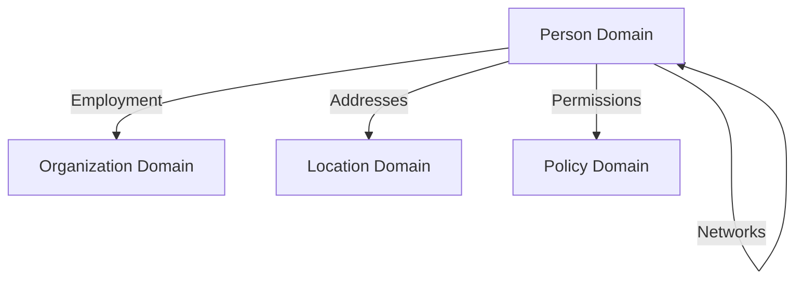

# Person Domain Documentation

Welcome to the Person domain documentation for the Composable Information Machine (CIM).

## Documentation Structure

### Core Documentation

1. **[Domain Overview](domain_overview.md)**
   - Executive summary and vision
   - Architecture principles
   - Key capabilities
   - Integration points

2. **[User Stories](user_stories.md)**
   - Comprehensive user stories organized by epic
   - Identity management scenarios
   - Component management patterns
   - Network analysis use cases
   - Privacy and compliance requirements

3. **[API Reference](api_reference.md)**
   - Core types and structures
   - Commands and events
   - Components and queries
   - Cross-domain relationships
   - Usage examples

### Implementation Guides

4. **[Implementation Guide](implementation_guide.md)**
   - Getting started with the Person domain
   - Common patterns and best practices
   - Integration with other domains
   - Troubleshooting common issues

5. **[Network Analysis Guide](network_analysis_guide.md)**
   - Relationship types and patterns
   - Network analysis algorithms
   - Performance optimization
   - Visualization integration

6. **[Testing Guide](testing_guide.md)**
   - Testing strategies and patterns
   - Unit, integration, and performance tests
   - Test data builders
   - CI/CD integration

## Quick Start

```rust
use cim_domain_person::{
    aggregate::{Person, PersonId},
    value_objects::PersonName,
};

// Create a person
let person_id = PersonId::new();
let name = PersonName::new("Alice", "Johnson");
let person = Person::new(person_id, name);

// Register components
person.register_component(ComponentType::EmailAddress)?;
```

## Key Concepts

### ECS Architecture
The Person domain follows an Entity Component System pattern where:
- **Person aggregate** contains only core identity
- **Components** provide all other attributes
- **Cross-domain relationships** connect to other domains

### Network Analysis
Powerful capabilities for analyzing relationships:
- Professional networks and hierarchies
- Influence scoring and community detection
- Geographic distribution analysis
- Collaboration opportunity identification

### Privacy and Compliance
Built-in support for:
- GDPR compliance (right to be forgotten)
- Component-level access control
- Audit trails for all operations
- Configurable retention policies

## Domain Relationships



## Getting Help

- Review the [Implementation Guide](implementation_guide.md) for common patterns
- Check the [API Reference](api_reference.md) for detailed type information
- See the [Testing Guide](testing_guide.md) for test examples
- Consult [User Stories](user_stories.md) for business scenarios

## Contributing

When contributing to the Person domain:
1. Follow the ECS architecture principles
2. Write tests using TDD approach
3. Include Mermaid diagrams in test documentation
4. Update relevant documentation
5. Ensure 95%+ test coverage 